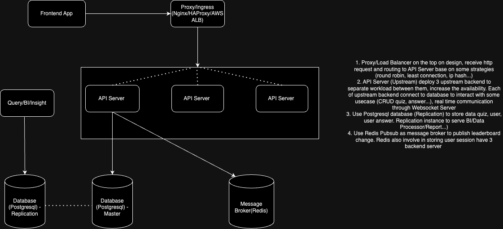

# Elsa coding challenge

## High Level Design

## About the components
- Frontend Web: The component interact with backend through HTTP Request and Websocket
- Proxy/Ingress Layer: which is responsible for receiving HTTP request
- API Servers (Upstream): Deploy 3 upstream servers to separate workloads and increase the availability of the system.
- Database (Postgresql)
    - Master Database: As the main database to store user data, quiz information and answers
    - Replication database: Act as read-only replica of master database. Should separate read workloads to read only database. This design will offload some database load from master instance
- Message Broker (Redis)
    - Store user session: This ensures that session data is available to all API servers in a distributed environment
    - Pub/sub: publish changes such as leaderboard changes, notify users immediately about changes without delays